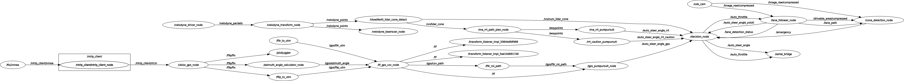
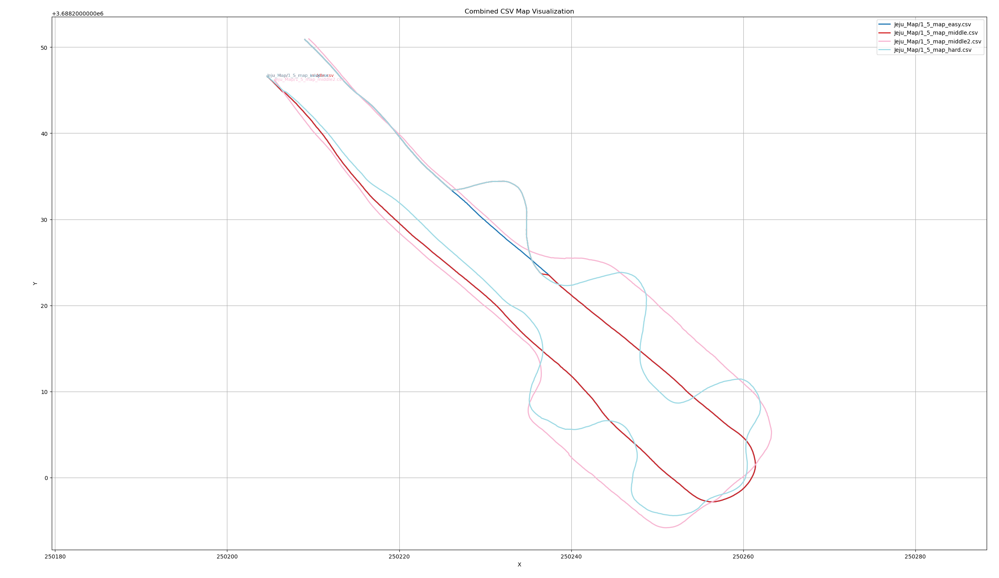
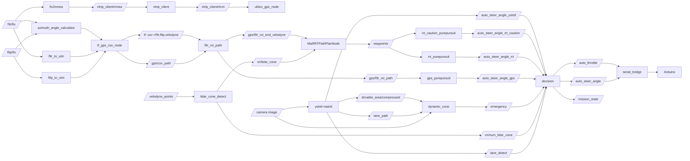

# Jejudol_ws

## 2026 제5회 국제 대학생 EV 자율주행 경진대회(1/5) 소프트웨어 포트폴리오

본 workspace는 **제5회 국제 대학생 EV 자율주행 경진대회 1/5 부문** 실차 주행을 위해 구성한 ROS 2 워크스페이스이며, 아래 내용들을 다룹니다.
- 실제 트랙 규정 기반 설계 의도
- 노드 실행 순서와 의존 관계
- 각 노드의 입력/출력/핵심 판단 로직
- 센서-인지-계획-판단-제어까지의 End-to-End 체인

---

## 1. Competition Context (규정 기반 설계 배경)

참고: `제5회 국제 대학생 EV 자율주행 경진대회 1_5사이즈 부문.pdf`

- 트랙 구성: 차선 구간 + GPS 구간 + 터널 구간 (약 300m)
- 차선 구간: GPS 사용 금지, 카메라/라이다 기반 주행 필수
- GPS 구간: RDDF Waypoint 제공, 좌표 간격 20cm, 기준 좌표계 UTM_52N
- 동적 장애물: 코스 내 진입 및 정지 가능, 차량은 긴급정지 또는 회피 수행
- 하드웨어 규정:
  - 라이다: 2D 1개 + 3D 1개 가능, 3D는 300,000 points/s 이하
  - 카메라: 일반 카메라 허용, 스마트카메라(내장형 연산/제어 일체)는 불가
  - 컨트롤러/GPU 사용 가능(차량 크기/전원 규정 준수 조건)

---

## 2. Team

| Name | Department | Role |
|---|---|---|
| CHOI DAE SEUNG | Applied Statistics | Team Lead; 3D LiDAR-GNSS sensor fusion; decision-making node development |
| YOO SEUNG HOON | Mechanical, Robotic and Automotive Engineering | Vehicle platform fabrication; Arduino firmware development |
| KIM BUM SU | Mechanical and Aerospace Engineering | Vehicle platform fabrication; Arduino firmware development |
| HAN SEON JU | Mechanical, Robotic and Automotive Engineering | Camera-based lane-following software development |
| KIM DO YUL | COMPUTER SCIENCE AND ENGINEERING | Dynamic obstacle assessment logic development; mission-course decision node development |


---

## 3. System Snapshot

### 3.1 ROS Graph

<p align="center">
  
</p>

### 3.2 Global Map (CSV Path)

<p align="center">
  
</p>

---

## 4. End-to-End Architecture



---

## 5. Build & Dependencies

### 5.1 System Dependencies (현장 설치 기록 기반)

```bash
python -m pip install backports.tarfile
sudo apt install -y libasio-dev
sudo apt install -y ros-humble-diagnostic-updater ros-humble-nmea-msgs
sudo apt install -y python3-serial
sudo apt install -y v4l-utils ros-humble-image-transport-plugins ros-humble-compressed-image-transport ros-humble-rqt-image-view
sudo apt install -y ros-humble-camera-info-manager
```

### 5.2 Build

```bash
cd ~/Jejudol_ws
colcon build --symlink-install
source install/setup.bash
```

---

## 6. Bring-up Runbook (실행 순서 + 의도)

아래 순서는 현장 매뉴얼을 기준으로 정리했으며, 각 단계는 다음 단계의 입력 토픽을 준비합니다.

| Step | 목적 | 실행 명령 |
|---|---|---|
| 0 | RTK Caster 설정 | `src/RTK_GPS_NTRIP/ntrip_client/launch/ntrip_client_launch.py`에서 `mountpoint` 수정 |
| 1 | GNSS 원시 데이터 수집 | `ros2 launch ublox_gps ublox_f9p_launch.py`<br>`ros2 launch ublox_gps ublox_f9r_launch.py` |
| 2 | NMEA 생성 + RTK 보정 연결 | `ros2 run fix2nmea fix2nmea`<br>`ros2 launch ntrip_client ntrip_client_launch.py` |
| 3 | CSV 맵 생성/교체(오프라인) | `python3 data/f9r_to_csv.py` 후 `src/utm_tf/config/tf_gps_csv.yaml` 업데이트 |
| 3-1 | 카메라 체커보드 캘리브레이션(오프라인) | `python3 src/yolotl_ros2/yolotl_ros2/utils/camera_calibration.py --image-dir <dir> --board-w 7 --board-h 10 --output camera_params.npz` |
| 4 | 카메라 기반 주행 라인 생성 | `ros2 run usb_cam usb_cam_node_exe --ros-args -p video_device:="/dev/video2" -p pixel_format:="mjpeg2rgb"`<br>`ros2 run yolotl_ros2 main6`<br>`ros2 run dynamic_cone dynamic_cone` |
| 5 | 3D 라이다 콘 인식 | `rv` (현장 alias) <br>`ros2 run voxelnext_ros2 lidar_cone_detect.py` |
| 6 | GPS/CSV/센서 TF 정렬 | `ros2 launch utm_tf tf_gps_csv.launch.py` |
| 7 | CSV ROI 경로 생성 | `ros2 launch gps_planning f9r_roi_path.launch.py` |
| 8 | GPS Pure Pursuit 조향 생성 | `ros2 run gps_planning gps_purepursuit.py` |
| 9 | RRT 경로 생성 + 조향 생성 | `ros2 run rrt_planning main.py`<br>`ros2 run rrt_planning rrt_purepursuit.py`<br>`ros2 run rrt_planning rrt_caution_purepursuit` |
| 10 | 판단/상태 가시화 | `ros2 run decision_maker decision`<br>`ros2 run decision_maker visualizer` |
| 11 | 차량 제어 인터페이스 | `ros2 run serial_bridge serial_bridge --ros-args -p port:=/dev/arduino_bridge` |

---

## 7. Node Deep Dive (실제 코드 기반)

주요 실행 노드를 실제 코드 기준으로 정리했습니다.

### 7.1 `ublox_f9p_launch.py`

- 코드: `src/RTK_GPS_NTRIP/ublox_gps/launch/ublox_f9p_launch.py`
- 실행: `ros2 launch ublox_gps ublox_f9p_launch.py`
- 핵심:
  1. `zed_f9p.yaml` 파라미터로 `ublox_gps_node` 실행
  2. `/ublox_gps_node/fix -> /f9p/fix`로 리맵
  3. `/ublox_gps_node/fix_velocity -> /f9p/fix_velocity`로 리맵
  4. `show_fix_hz=true`일 때 `ros2 topic hz /f9p/fix`를 자동 실행해 수신율 모니터링
  5. 드라이버 프로세스 종료 시 런치 전체를 안전하게 종료

### 7.2 `ublox_f9r_launch.py`

- 코드: `src/RTK_GPS_NTRIP/ublox_gps/launch/ublox_f9r_launch.py`
- 실행: `ros2 launch ublox_gps ublox_f9r_launch.py`
- 핵심:
  1. `zed_f9r.yaml` 기반 `ublox_gps_node` 실행
  2. `/f9r/fix`, `/f9r/fix_velocity` 토픽 생성
  3. `show_fix_hz` 플래그로 `/f9r/fix` 실시간 수신율 확인

### 7.3 `ntrip_client_launch.py`

- 코드: `src/RTK_GPS_NTRIP/ntrip_client/launch/ntrip_client_launch.py`
- 실행: `ros2 launch ntrip_client ntrip_client_launch.py`
- 핵심:
  1. Caster 연결 정보(`host/port/mountpoint`)와 인증정보를 런치 인자로 주입
  2. `NTRIP_CLIENT_DEBUG` 환경변수로 디버그 로그 레벨 제어
  3. 노드는 `ntrip`(입력)과 `rtcm`(출력)을 사용하며 namespace가 `ntrip_client`이므로 실제 토픽은 `/ntrip_client/nmea`, `/ntrip_client/rtcm`
  4. reconnect/timeout 파라미터로 통신 단절에 복구 시도

### 7.4 `fix2nmea.cpp`

- 코드: `src/RTK_GPS_NTRIP/fix2nmea/src/fix2nmea.cpp`
- 실행: `ros2 run fix2nmea fix2nmea`
- 입력: `fix_topic` 파라미터(기본 `/f9r/fix`)
- 출력: `/ntrip_client/nmea`
- 핵심 로직:
  1. `NavSatFix`를 `$GNGGA` 문장으로 변환
  2. 위경도 도/분 포맷 변환, fix status를 NMEA quality로 매핑
  3. 서비스 비트(`GPS/GLONASS/BEIDOU/GALILEO`) 기반 위성 수 추정
  4. 고도 보정(`altitude - 1.2`) 적용
  5. XOR checksum 계산 후 NMEA sentence 발행

### 7.5 `f9r_to_csv.py` (오프라인 유틸리티)

- 코드: `data/f9r_to_csv.py`
- 실행: `python3 data/f9r_to_csv.py`
- 핵심 로직:
  1. rosbag2에서 `/f9r/fix`만 필터링
  2. 첫 좌표의 경도로 UTM Zone을 자동 결정
  3. WGS84(lat/lon) -> UTM(E/N) 변환
  4. `X(E/m), Y(N/m)` CSV 저장 (고정밀 포맷)

### 7.6 `tf_gps_csv.yaml` (런타임 맵 설정)

- 코드: `src/utm_tf/config/tf_gps_csv.yaml`
- 역할:
  1. `tf_gps_csv_node`가 로드할 글로벌 경로 CSV를 지정
  2. 현장 주행 방향(정/역방향) 교체를 파라미터 파일 수정만으로 처리

### 7.7 `camera.launch.py`

- 코드: `src/usb_cam/launch/camera.launch.py`
- 실행(런치): `ros2 launch usb_cam camera.launch.py`
- 현장 실행(직접 run):
  - `ros2 run usb_cam usb_cam_node_exe --ros-args -p video_device:="/dev/video2" -p pixel_format:="mjpeg2rgb"`
- 핵심:
  1. `CameraConfig` 목록(`params_1.yaml`)을 읽어 `usb_cam_node_exe`를 생성
  2. namespace/remap/파라미터가 카메라별로 독립 적용
  3. 결과로 `image_raw`, `camera_info` 계열 토픽 공급

### 7.8 `camera_calibration.py` (체커보드 실측 캘리브레이션)

- 코드: `src/yolotl_ros2/yolotl_ros2/utils/camera_calibration.py`
- 목적:
  - 체커보드 이미지로 카메라 내부파라미터와 왜곡계수 계산
- 실행:
  - `python3 src/yolotl_ros2/yolotl_ros2/utils/camera_calibration.py --image-dir <checkerboard_jpg_dir> --board-w 7 --board-h 10 --output camera_params.npz`
- 입력: 체커보드 이미지(`*.jpg`), 내부 코너 수(`board_w`, `board_h`)
- 출력: `camera_params.npz` (`mtx`, `dist`, `rvecs`, `tvecs`)
- 핵심:
  1. `findChessboardCorners`로 코너 검출
  2. `cornerSubPix`로 정밀화
  3. `calibrateCamera`로 `mtx/dist` 계산 후 저장
- 주의:
  - 코너 검출 성공 프레임이 없으면 실패
  - `main6.py`는 `camera_calibration.pkl`을 읽으므로 결과 파일 포맷을 맞춰서 사용

### 7.9 `main6.py` (`yolotl_ros2`)

- 코드: `src/yolotl_ros2/yolotl_ros2/main6.py`
- 실행: `ros2 run yolotl_ros2 main6`
- 입력:
  - 카메라 이미지(`/image_raw/compressed` 기본)
  - `/auto_throttle` (동적 lookahead 계산용)
- 출력:
  - `/auto_steer_angle_yolotl`
  - `/lane_detect`
  - `/lane_path`
  - `/drivable_area/compressed`
  - `lookahead_distance`
- 주요 상수/파라미터(코드값):
  - `L=0.73`, `MAX_STEER_DEG=23.0`, `MAX_STEER_RATE=12.0 deg/frame`
  - `THROTTLE_MIN_FOR_LD=0.4`, `THROTTLE_MAX_FOR_LD=0.8`
  - `MIN_LOOKAHEAD_DISTANCE=2.4`, `MAX_LOOKAHEAD_DISTANCE=2.8`
  - `MAX_LANE_AGE=7`
  - BEV 변환 스케일: `m_per_pixel_y=0.0027`, `m_per_pixel_x=0.0030`, `y_offset_m=1.23`
- 상세 로직:
  1. **초기화 단계**
     - `arrow_model`(화살표 제거용) + lane 모델(차선 세그멘테이션용) 2개를 로드
     - `bev_params_*.npz`에서 `src_points/dst_points/warp_w/warp_h`를 읽어 투시변환 준비
     - `camera_calibration.pkl`에서 `camera_matrix/dist_coeffs`를 읽어 undistort 파이프라인 구성
  2. **입력 디코딩 단계**
     - 토픽 타입이 `Image`면 `CvBridge`, `CompressedImage`면 `cv2.imdecode` 경로로 디코딩
     - 디코딩 실패 프레임은 즉시 스킵(노드 연속성 유지)
  3. **왜곡 보정 + 화살표 마스킹**
     - `cv2.getOptimalNewCameraMatrix`와 `cv2.undistort`로 왜곡 보정
     - 화살표 세그/박스 결과 영역을 원본에서 제거해 lane 모델 입력 정제
  4. **BEV 세그멘테이션**
     - BEV 변환 영상에 lane 모델 추론 수행
     - detection별 마스크를 bbox 안에서 최대 연결성분만 남기고 centerline 점열 추출
  5. **좌/우 차선 트래킹**
     - `current_detections`를 하단 x 기준 정렬
     - 이전 프레임 `last_left_x/last_right_x`와의 거리로 좌/우 재매칭
     - 한쪽만 보일 때는 기존 트랙 근접도 + 화면 중앙 기준으로 측면 판정
     - 미검출 lane은 age 증가, `MAX_LANE_AGE` 초과 시만 폐기
  6. **중심 경로 생성**
     - 양측 lane 존재 시 융합(`compute_fusion_centerline`)
     - 단측만 있을 때는 lane 폭 오프셋으로 centerline 생성
     - 최종 centerline은 `smooth_and_interpolate_path(..., num_points=100)`로 보간
  7. **`/lane_path` 발행**
     - 보간 경로를 역순(step=20) 샘플링해 `Path(frame_id='base_link')`로 발행
     - 각 점은 `image_to_vehicle()`로 차량 좌표 변환
  8. **동적 Lookahead 계산**
     - `/auto_throttle`를 `[0.4, 0.8]`로 클리핑한 뒤 `2.4~2.8m`로 선형 매핑
     - 유효 lane이 없으면 `last_valid_ld` 유지
  9. **Pure Pursuit 조향 계산**
     - 기본 모드는 전방점 중 `|dist-Ld|` 최소점 선택(`use_arc_length_lookahead=False`)
     - `steer_rad = atan2(2*L*y, x^2+y^2)`, 부호 반전 후 ±23도 클램프
     - 프레임간 변화량을 ±12deg로 제한해 급조향 억제
  10. **시각화/디버그 출력**
      - BEV 로그 화면 + 원본 오버레이를 생성하고 `/drivable_area/compressed` 발행
      - `lane_detect`, `lookahead_distance`, 조향각 텍스트를 동시 제공
- 실패/안전 처리:
  - 캘리브레이션 파일 로딩 실패 시 undistort 없이 계속 동작(치명 종료 방지)
  - lookahead point를 못 찾으면 해당 프레임 조향 publish를 생략해 급격한 이상 명령을 억제

### 7.10 `dynamic_cone.py`

- 코드: `src/dynamic_cone/dynamic_cone/dynamic_cone.py`
- 실행: `ros2 run dynamic_cone dynamic_cone`
- 입력:
  - 카메라 이미지
  - `/lane_path`
  - `/drivable_area/compressed`
- 출력:
  - `/cone_detection/compressed`
  - `/emergency`
- 핵심 로직:
  1. YOLO로 콘 검출
  2. `drivable_area`의 녹색 오버레이 마스크를 만들고, 각 검출 박스와의 겹침비를 계산
  3. 겹침비가 `obstacle_threshold` 이상이면 주행 경로상 장애물로 판단
  4. 장애물로 분류된 콘 개수가 `2~3개`일 때 단기 emergency 펄스 생성
  5. 결과 이미지를 `/cone_detection/compressed`로 제공해 현장 디버깅 가능

### 7.11 `lidar_cone_detect.py` (VoxelNeXt 실시간 추론)

- 코드: `src/voxelnext_ros2/scripts/lidar_cone_detect.py`
- 실행: `ros2 run voxelnext_ros2 lidar_cone_detect.py`
- 입력: `/velodyne_points`
- 출력:
  - `/vn/lidar_cone` (콘 중심 MarkerArray)
  - `/vn/detected_class` (클래스 텍스트 MarkerArray)
  - `/vn/num_lidar_cone` (ROI 내 콘 수, Int8)
  - `/vn/num_lidar_cone_roi` (ROI 시각화 Marker)
- 핵심 로직:
  1. PointCloud2를 NumPy로 변환해 `(x,y,z,intensity,timestamp)` 구조화
  2. VoxelNeXt 추론 후 `traffic_cone` 클래스만 필터링
  3. ROI(`x:-0.2~5.5`, `y:-1.5~1.5`) 내부 검출 개수를 집계해 `/vn/num_lidar_cone` 발행
  4. 입력 큐를 `maxsize=1`로 유지해 stale frame 누적을 방지 (지연 대신 최신성 우선)
  5. pre/voxel/infer/publish 타이밍 로그를 제공해 성능 병목 추적 가능

### 7.12 `tf_gps_csv.launch.py` (내부 4개 노드 포함)

- 코드:
  - 런치: `src/utm_tf/launch/tf_gps_csv.launch.py`
  - 노드: `src/utm_tf/src/f9p_to_utm.cpp`, `f9r_to_utm.cpp`, `azimuth_angle_calculator.cpp`, `tf_velodyne_gps_csv.cpp`
- 실행: `ros2 launch utm_tf tf_gps_csv.launch.py`
- 노드별 상세:
  1. **f9p_to_utm / f9r_to_utm**
     - 입력: `/f9p/fix`, `/f9r/fix` (`NavSatFix`)
     - 처리: `toUTM(latitude, longitude)`로 UTM 변환
     - 출력: `/gps/f9p_utm`, `/gps/f9r_utm` (`PointStamped`, `frame_id='utm'`)
     - 예외: 위도 범위가 UTM 변환 가능 범위 밖이면 publish 생략
  2. **azimuth_angle_calculator_node**
     - 입력: `/f9r/fix`, `/f9p/fix`
     - 처리:
       - 두 GPS 메시지 수신 후 timestamp 차이 검사(`max_time_diff_sec`, 기본 0.1s)
       - f9r->f9p bearing 계산 후 `0~360 deg` 정규화
     - 출력: `/gps/azimuth_angle` (`Float64`)
     - 예외: 시간차 임계 초과 시 해당 샘플 계산 스킵
  3. **tf_gps_csv_node**
     - 입력: `/gps/f9r_utm`, `/gps/f9p_utm`, `/gps/azimuth_angle`, `csv_file_path`
     - 처리:
       - CSV 로딩 시 첫 점을 원점으로 저장하고 나머지를 상대좌표로 변환
       - `/gps/csv_path`를 `transient_local + reliable` QoS로 20Hz publish
       - yaw 변환식 적용: `yaw_rad = (90 - azimuth_deg) * pi/180`
       - `csv->f9r`, `csv->f9p` TF broadcast
       - f9r->f9p 방향 단위벡터 기준 0.82m 전방에 `csv->velodyne` TF 생성
       - `/gps/azimuth_angle_text` 마커 발행
     - 예외:
       - CSV 파일 없음/파싱 실패 시 오류 로그 후 경로 발행 불가
       - f9r/f9p baseline이 너무 짧으면 velodyne TF 갱신 스킵
- 데이터 흐름 요약:
  1. `/f9r/fix`, `/f9p/fix` -> UTM 변환
  2. UTM + azimuth + CSV를 `tf_gps_csv_node`가 결합
  3. 결과로 `/gps/csv_path`와 `csv` 기준 센서 TF(`f9r`, `f9p`, `velodyne`)를 제공

### 7.13 `f9r_roi_path.cpp`

- 코드: `src/gps_planning/src/f9r_roi_path.cpp`
- 실행: `ros2 launch gps_planning f9r_roi_path.launch.py`
- 입력:
  - `/gps/csv_path` (transient_local)
  - `/f9r/fix` (트리거성 수신)
  - TF(`target_frame=f9r`, `csv_frame=csv`)
- 출력:
  - `/gps/f9r_roi_path` (LINE_STRIP Marker)
  - `/gps/f9r_roi_end` (SPHERE Marker)
  - `/gps/f9r_roi_end_velodyne` (PointStamped)
- 핵심 로직:
  1. 현재 f9r 원점을 csv 프레임으로 변환
  2. 후보 인덱스 영역에서 최근접 점을 찾고, 이전 시작점 대비 단조성+히스테리시스로 점프 방지
  3. ROI 길이를 거리(m) 또는 포인트 개수 기준으로 절단
  4. ROI 끝점을 `velodyne` 프레임으로 변환해 RRT 타겟으로 제공

### 7.14 `gps_purepursuit.py`

- 코드: `src/gps_planning/scripts/gps_purepursuit.py`
- 실행: `ros2 run gps_planning gps_purepursuit.py`
- 입력: `/gps/f9r_roi_path` (Marker LINE_STRIP)
- 출력:
  - `/auto_steer_angle_gps`
  - `/gps/lookahead_point`
- 핵심 로직:
  1. 경로 프레임에서 현재 차량 최근접점 탐색
  2. 누적 arc length 기반으로 `gps_purepursuit_ld` 거리의 목표점 선택
  3. 목표점을 `target_frame(f9r)`로 변환 후 Pure Pursuit 조향 계산
  4. 경로/TF 누락 시 안전하게 조향 `0.0` 발행

### 7.15 `main.py` + `MaRRTPathPlanNode.py`

- 코드:
  - `src/rrt_planning/src/main.py`
  - `src/rrt_planning/src/MaRRTPathPlanNode.py`
  - `src/rrt_planning/src/ma_rrt.py`
- 실행: `ros2 run rrt_planning main.py`
- 입력:
  - `/vn/lidar_cone` (장애물 중심)
  - `/odometry` (yaw)
  - `/gps/f9r_roi_end_velodyne` (RRT 목표점)
- 출력:
  - `/waypoints`, `/newwaypoints`
  - `/rrt/tree_branch`, `/rrt/best_tree_branch`, `/rrt/filtered_tree_branch` 등 시각화
- 핵심 로직:
  1. 전방 콘만 필터링(`getFrontConeObstacles`) 후 원형 장애물 리스트 생성
  2. 목표점 우선순위:
     - 1순위: ROI 끝점(`/gps/f9r_roi_end_velodyne`)
     - 2순위: fallback 조건을 만족하는 전방 콘
  3. `ma_rrt`에서 조향 제약(turn angle) 기반 트리 샘플링 수행
  4. leaf branch를 주변 콘 분포(좌/우 균형, 거리 가중치)로 rating하여 best branch 선택
  5. 급격한 분기 변화는 `getFilteredBestBranch`에서 저역통과+discard reset으로 안정화
  6. Delaunay edge와 branch 교차점을 이용해 주행 waypoints 생성/병합

### 7.16 `rrt_purepursuit.py`

- 코드: `src/rrt_planning/src/rrt_purepursuit.py`
- 실행: `ros2 run rrt_planning rrt_purepursuit.py`
- 입력: `/waypoints`, `/odometry`, `/auto_throttle`
- 출력:
  - `/auto_steer_angle_rrt`
  - `/rrt/lookahead_point`
  - `/final_waypoints`
- 핵심 로직:
  1. `/waypoints`를 B-spline으로 보간해 등간격 제어점 생성
  2. velodyne 좌표계 제어점을 후륜축 기준 차량좌표로 변환
  3. 동적 lookahead(쓰로틀 기반)로 목표점 선택
  4. 마지막 제어점이 1m 이내면 정지조향(0) 출력

### 7.17 `rrt_caution_purepursuit.py`

- 코드: `src/rrt_planning/src/rrt_caution_purepursuit.py`
- 실행: `ros2 run rrt_planning rrt_caution_purepursuit`
- 입력/출력 구조는 `rrt_purepursuit`와 동일
- 차이점:
  1. 출력 조향 토픽이 `/auto_steer_angle_rrt_caution`
  2. caution 전용 lookahead 기본값(`lookahead_distatnce_caution`)을 사용해 더 보수적 추종

### 7.18 `decision.py`

- 코드: `src/decision_maker/decision_maker/decision.py`
- 실행: `ros2 run decision_maker decision`
- 입력:
  - `/lane_detect`
  - `/vn/num_lidar_cone`
  - `/emergency`
  - `/auto_steer_angle_rrt`
  - `/auto_steer_angle_rrt_caution`
  - `/auto_steer_angle_yolotl`
  - `/auto_steer_angle_gps`
- 출력:
  - `/auto_steer_angle`
  - `/auto_throttle`
  - `/mission_state`
  - `/moon_course_hold`
- 핵심 로직:
  1. `emergency/moon_course/lane/gps/static_obstacle/rrt` 상태머신으로 제어 소스 선택
  2. 상태 전환 시 선형 감속 프로파일(`decelerate_to_*_sec`) 적용
  3. emergency 입력 해제 직후에도 recovery delay 동안 throttle 0 유지
  4. 조향 절대값 제한, 쓰로틀 상한 제한으로 최종 안전장치 적용
  5. 옵션으로 스페이스바 수동 감속 정지 토글 제공

### 7.19 `visualizer.py`

- 코드: `src/decision_maker/decision_maker/visualizer.py`
- 실행: `ros2 run decision_maker visualizer`
- 입력:
  - `/mission_state`, `/auto_throttle`, `/auto_steer_angle`
  - `/lane_detect`, `/vn/num_lidar_cone`, `/emergency`, `/moon_course_hold`
- 출력: `/decision/text_marker`
- 핵심:
  1. 상태/제어값/센서 플래그를 MarkerArray 텍스트로 RViz 오버레이
  2. 미션 상태별 색상 코딩으로 운영자 판단 속도 향상

### 7.20 `serial_bridge.py`

- 코드: `src/serial_bridge/serial_bridge/serial_bridge.py`
- 실행: `ros2 run serial_bridge serial_bridge --ros-args -p port:=/dev/arduino_bridge`
- 입력: `/auto_throttle`, `/auto_steer_angle`
- 출력: Serial TX (`TH x.xxx`, `SA x.xxx`)
- 핵심 로직:
  1. 시리얼 자동 재연결 스레드로 포트 복구
  2. 시작 직후 `startup_silence_sec` 동안 송신 금지(급발진 방지)
  3. TX/RX 로그를 ROS 로그로 출력해 제어-펌웨어 링크 디버깅
  4. throttle는 `[-1, 1]`로 클램프 후 전송

---

## 8. Decision & Vehicle Control Summary

`decision.py`의 핵심 전이 규칙을 운용 관점으로 요약하면 아래와 같습니다.

| State | 진입 조건 | Steer Source | Throttle Policy |
|---|---|---|---|
| `emergency` | `/emergency=true` (단 moon hold 우선) | `yolotl` | 현재값에서 목표값까지 선형 감속 |
| `moon_course` | `lane_detect=true` and `num_lidar_cone >= num_moon_course_threshold` 또는 hold 유지 | `rrt_caution` | 조향각 역비례 맵핑 + 전환 감속 |
| `lane` | 차선 검출 유효, 문코스/긴급 아님 | `yolotl` | 조향각 역비례 맵핑 + 전환 감속 |
| `gps` | 콘 0개 & lane 미검출 & 긴급 아님 | `gps` | 고정 throttle (`auto_throttle_gps`) |
| `static_obstacle` | 차선 미검출 & 콘 수가 정적장애 기준 이상 | `rrt_caution` | 고정 저속 throttle |
| `rrt` | 차선 미검출 & 콘 존재(정적장애 기준 미만) | `rrt` | 조향각 역비례 맵핑 + 전환 감속 |

### 8.1 Serial Bridge -> Arduino(`final.ino`) 제어 체인

- 코드:
  - ROS 측: `src/serial_bridge/serial_bridge/serial_bridge.py`
  - MCU 측: `arduino/final/final.ino`
- 체인:
  1. `decision.py`가 `/auto_throttle`, `/auto_steer_angle` 생성
  2. `serial_bridge.py`가 이를 `TH x.xxx`, `SA x.xxx` 문자열로 변환해 UART(57600) 송신
  3. `final.ino`가 line 단위로 파싱해 실제 모터/조향 PWM으로 변환

### 8.2 `final.ino` 상세 로직

이 스케치의 핵심 역할은 단순한 모터 드라이버가 아니라, **자율 명령(ROS)과 수동 RC 입력을 중재하는 차량 최종 제어 게이트웨이**입니다.  
즉, `serial_bridge`에서 넘어온 `TH/SA`를 그대로 바퀴에 전달하지 않고, 모드 판정·유효성 검사·타임아웃·폐루프 조향을 거친 뒤에만 출력합니다.

제어 아키텍처는 3단으로 동작합니다.

1. **입력 수집 계층**
   - RC 수신기(조향/가감속/모드), 시리얼 명령(`TH`, `SA`), 조향 포텐셔미터, 엔코더를 동시에 수집합니다.
   - RC PWM은 인터럽트로 펄스폭을 측정하고, 시리얼은 라인 단위 파싱으로 명령을 해석합니다.

2. **판정/안전 계층**
   - 모드 스위치에 따라 `BREAK` / `MANUAL` / `AUTO`를 결정합니다.
   - AUTO는 RC가 AUTO 모드일 때만 활성화되어, 운전자가 상위 우선권을 항상 가집니다.
   - `THROTTLE_TIMEOUT_MS`, `STEER_TIMEOUT_MS` watchdog으로 통신 단절을 감지하며,
     - throttle 타임아웃 시 즉시 정지(`th=0`)
     - steer 타임아웃 시 RC 조향 기준으로 폴백
     하도록 설계되어 있습니다.

3. **출력 실행 계층**
   - 조향은 포텐셔미터 기반 실제 조향각을 피드백으로 쓰는 PID 폐루프(`KP/KI/KD`)로 구동합니다.
   - 주행은 수동 모드에서 RC 스로틀, 자동 모드에서 `TH` 명령을 사용합니다.
   - 자동 주행 출력은 `driveWithDeadtime()`을 통해 방향 전환 시 짧은 deadtime(200us)을 강제해 H-bridge 스트레스를 줄이고 역전환 충격을 완화합니다.

핵심 로직은 아래와 같습니다.

1. **모드 우선순위 판정**
   - `Manual_us > 1600`이면 `MANUAL_MODE`
   - 그렇지 않고 `Auto_us > 1600`이면 `AUTO_MODE`
   - 둘 다 아니면 `BREAK_MODE`로 강제 정지
2. **시리얼 명령 유효화**
   - `TH`는 `[-1.0, 1.0]`, `SA`는 `[-24deg, +24deg]`로 클램프
   - 수신 시각을 기록해 freshness 플래그를 갱신
3. **통신 watchdog**
   - `th_ok = (millis()-lastThrottleMs <= 500ms)`
   - `sa_ok = (millis()-lastSteerMs <= 500ms)`
   - AUTO에서 `th_ok=false`면 스로틀을 `0.0`으로 강제
   - AUTO에서 `sa_ok=false`면 조향은 RC 기준 PID(`u_rc`)로 자동 폴백
4. **조향 폐루프**
   - 목표각: AUTO는 `steer_auto_deg`, 수동/폴백은 RC pulse(1280~1792us) 매핑값
   - 현재각: 포텐셔미터(`A0`)를 `+24deg ~ -24deg`로 매핑
   - 제어: `u = PID(ref, sense, dt)` -> deadband -> `[-1,1]` 클램프 -> `Steer(u)`
5. **주행 출력**
   - MANUAL: RC throttle로 전/후진(`|Throttle_input| > 0.05`), 출력은 `0.6` 스케일
   - AUTO: `driveWithDeadtime(th)` 적용
   - 방향 반전 시 PWM을 0으로 떨군 뒤 `200us` deadtime 후 방향 전환
   - `|th| < 0.05`는 정지로 처리
6. **기동 안정화**
   - 부팅 시 `StopMotor()` 후 `CenterSteeringOnce()` 수행
   - 최대 `1.2s` 동안 조향을 0deg 근처(허용오차 3deg)로 정렬 후 메인 루프 진입
7. **실시간성/일관성**
   - RC 펄스/엔코더는 인터럽트에서 수집
   - 메인 루프는 `ATOMIC_BLOCK`으로 공유값을 안전하게 스냅샷해 제어 계산

---

## 9. Field Checklist (실전 점검)

- GNSS
  - `ros2 topic hz /f9p/fix`
  - `ros2 topic hz /f9r/fix`
- RTK
  - `/ntrip_client/rtcm` 수신 여부 확인
- 카메라
  - `/lane_detect` true/false 변화 확인
  - `/drivable_area/compressed` 프레임 확인
- 라이다
  - `/vn/num_lidar_cone` 값 변화 확인
- 계획/조향
  - `/auto_steer_angle_gps`, `/auto_steer_angle_rrt`, `/auto_steer_angle_rrt_caution`
- 최종 판단/제어
  - `/mission_state`, `/auto_throttle`, `/auto_steer_angle`
- 시리얼
  - `serial_bridge` 로그에서 `TX: TH ...`, `TX: SA ...` 확인

---

## 10. Source Index

- `src/RTK_GPS_NTRIP/ublox_gps/launch/ublox_f9p_launch.py`
- `src/RTK_GPS_NTRIP/ublox_gps/launch/ublox_f9r_launch.py`
- `src/RTK_GPS_NTRIP/ntrip_client/launch/ntrip_client_launch.py`
- `src/RTK_GPS_NTRIP/fix2nmea/src/fix2nmea.cpp`
- `data/f9r_to_csv.py`
- `src/utm_tf/config/tf_gps_csv.yaml`
- `src/usb_cam/launch/camera.launch.py`
- `src/yolotl_ros2/yolotl_ros2/utils/camera_calibration.py`
- `src/yolotl_ros2/yolotl_ros2/main6.py`
- `src/dynamic_cone/dynamic_cone/dynamic_cone.py`
- `src/voxelnext_ros2/scripts/lidar_cone_detect.py`
- `src/utm_tf/launch/tf_gps_csv.launch.py`
- `src/gps_planning/src/f9r_roi_path.cpp`
- `src/gps_planning/scripts/gps_purepursuit.py`
- `src/rrt_planning/src/main.py`
- `src/rrt_planning/src/rrt_purepursuit.py`
- `src/rrt_planning/src/rrt_caution_purepursuit.py`
- `src/decision_maker/decision_maker/decision.py`
- `src/decision_maker/decision_maker/visualizer.py`
- `src/serial_bridge/serial_bridge/serial_bridge.py`
- `arduino/final/final.ino`
