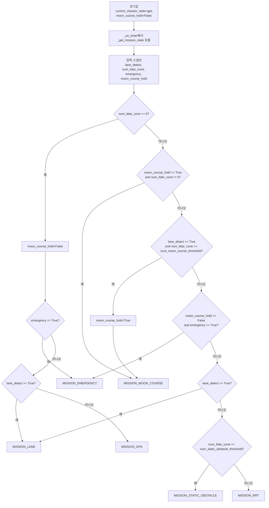

```mermaid
flowchart TD
    INIT[초기값<br/>current_mission_state=gps<br/>moon_course_hold=False] --> TICK[_on_timer에서 _get_mission_state 호출]
    TICK --> R[입력 스냅샷<br/>lane_detect, num_lidar_cone, emergency, moon_course_hold]
    R --> A{num_lidar_cone == 0?}

    A -- 예 --> B[moon_course_hold=False]
    B --> C{emergency == True?}
    C -- 예 --> E[MISSION_EMERGENCY]
    C -- 아니오 --> D{lane_detect == True?}
    D -- 예 --> F[MISSION_LANE]
    D -- 아니오 --> G[MISSION_GPS]

    A -- 아니오 --> H{moon_course_hold == True<br/>and num_lidar_cone != 0?}
    H -- 예 --> I[MISSION_MOON_COURSE]
    H -- 아니오 --> J{lane_detect == True<br/>and num_lidar_cone >= num_moon_course_threshold?}
    J -- 예 --> K[moon_course_hold=True]
    K --> I
    J -- 아니오 --> L{moon_course_hold == False<br/>and emergency == True?}
    L -- 예 --> E
    L -- 아니오 --> M{lane_detect == True?}
    M -- 예 --> F
    M -- 아니오 --> N{num_lidar_cone >= num_static_obstacle_threshold?}
    N -- 예 --> O[MISSION_STATIC_OBSTACLE]
    N -- 아니오 --> P[MISSION_RRT]

```